# Instantaneous Frequency
Demonstrating different interpretations and calculations of instantaneous frequency. The figures included in this package attempt to assist in one's understanding of the underlying processes. This educational tool come out of work done by Cole van Jaarsveldt, Prof. Gareth W. Peters, Prof. Mike Chantler, and Dr Matthew Ames. This package is free for all to use and should be cited appropriately. Some of the figures included are shown below.

## Time Series

All of the analysis techniques demonstrated below used the following time series. The example time series consists of two pure harmonics also known as sinusoids which is generic term for any Sine or Cosine function. The high frequency component and the low frequency component have frequencies of 5 rad/s and 1 rad/s respectively.  

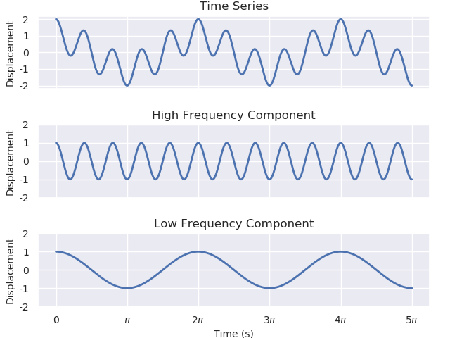

## Frequency (f) versus Angular Frequency ($\omega$)

Frequency is measured in Hertz (Hz) which has units of $s^{-1}$ which is per second. Angular frequency is measured in radians per second or $rad/s$ or $rad.s^{-1}$. The Diagram above demonstrates how these may be understood and used interchangeably.

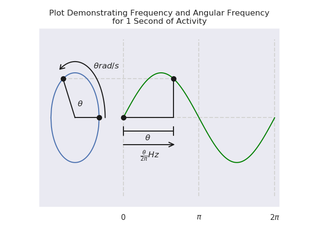

## Fourier Transform

The Fourier Transform of discrete time series, $x[t]$, of length $N$ is:

$X[t] = \sum_{n=0}^{N-1}x[n]e^{-i\frac{2\pi}{N}tn}, \text{ or}$

$X[t] = \sum_{n=0}^{N-1}x[n]\Big(\text{cos}(\frac{2\pi}{N}tn) - i\text{sin}(\frac{2\pi}{N}tn)\Big)$.

In the figure below, the two frequency structures are clearly discernible, but there are also additional frequency structures present. These additional structures are referred to as "ghost frequencies" because there are no actual structures present at those frequencies, but the Fourier transform produces the figure below when it is performed on a time series with a non-integer number of wavelengths. This will be discussed further in the next section.

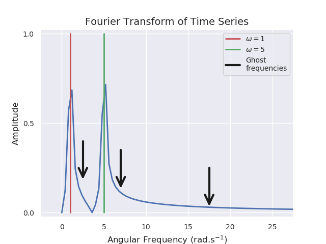

The heatmap below is another way of plotting the above figure. It is not necessary here as there is only frequency content and no temporal (or time) content. Why this is here will  be more clear when we look at the short-time Fourier transform (STFT) in a later section.

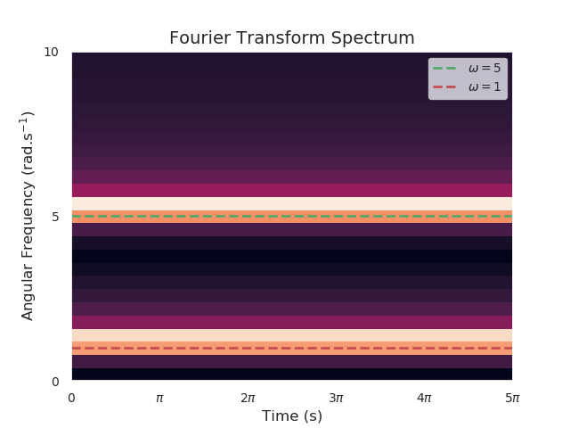

## Ghost Frequencies

Ghost frequency or ghost frequencies are informal terms used in the time-frequency analysis communities to describe and explain frequencies present in the Fourier spectrum that are not truly present in the temporal domain. These ghost frequencies are as a result of performing the Fourier transform (in the absence of a windowing technique) on time series that do not consist of an integer number of full wavelengths of underlying structures. The proliferation of Fourier bases are as a result of the optimisation algorithm trying to replicate the incomplete wavelength structures.

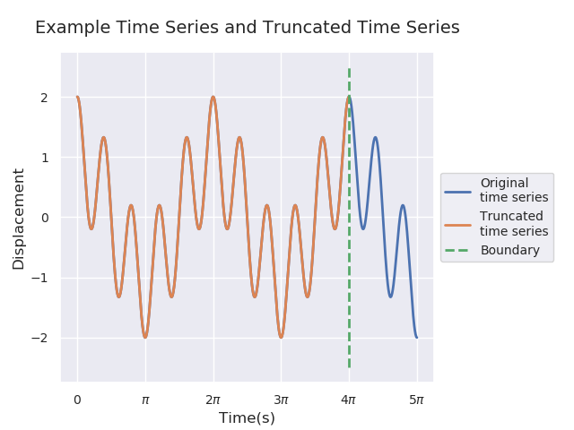

By truncating the time series as demonstrated above, one can resolve this issue as demonstrated below. This is, however, an ill-conceived 'solution' to the problem as potentially valuable temporal and frequency content of the time series would be discarded and lost in the analysis. There are a number of better-suited solutions which do not explicitly removed part of the time series. One such technique, called Tapering, is discussed below. 

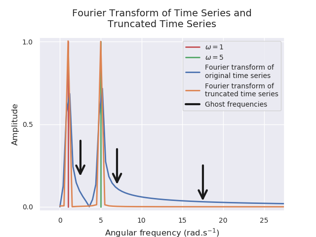

## Fourier Transform with Tapering

Many different families of windows are used in the literature. One of the most common windows used is the Hann window - often mistakenly referred to as a Hanning window which is a misnomer as a result of the other commonly used window: Hamming window. The Hann window and the Hamming window are both relatively simple members of a class of window functions called Cosine-Sum Windows. They are the simplest member of this class of functions and both be described using the following function: $ \omega(f) = a_0 + (1 - a_0)\text{cos}\bigg(\dfrac{\pi{f}}{f_N}\bigg), $ with $ f \in \bigg[-\dfrac{f_N}{2}, \dfrac{f_N}{2}\bigg] $.  When using the Hamming window one has $ a_0 = \dfrac{25}{46} $ and for the Hann window, one has $ a_0 = \dfrac{1}{2} $, from which it follows that $ \omega_{Hann}(f) = \dfrac{1}{2} + \dfrac{1}{2}\text{cos}\bigg(\dfrac{\pi{f}}{f_N}\bigg) $ and $ \omega_{Hann}(f) = 0 $ when $ f \in \bigg\{-\dfrac{f_N}{2}, \dfrac{f_N}{2}\bigg\} $. In the example in the figure below one has $ \omega(f) = 2\text{cos}\Bigg(\dfrac{\pi\big({t} - \frac{5}{2}\big)}{\frac{5}{2}}\Bigg) + 1 $ with $ t \in \bigg[0, 5\bigg]. $ 

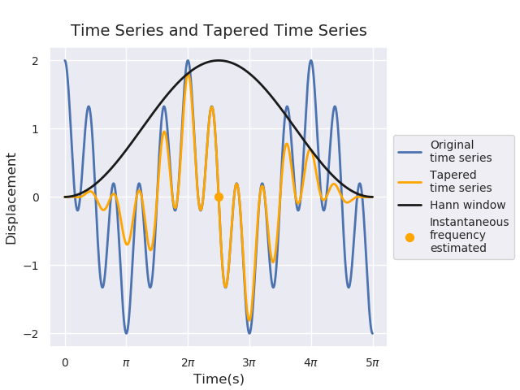

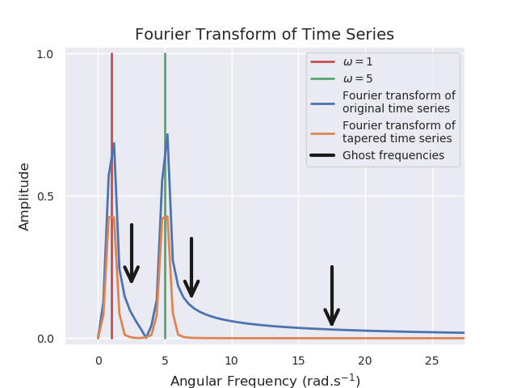

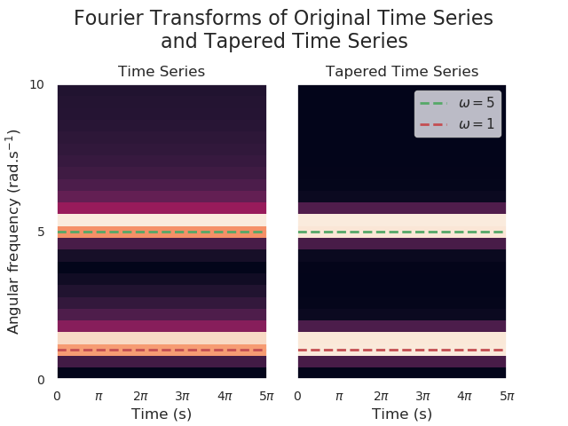

### Short-Time Fourier Transform

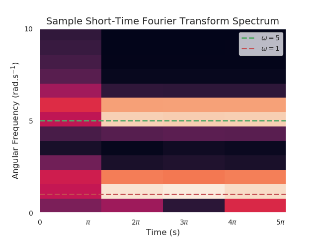

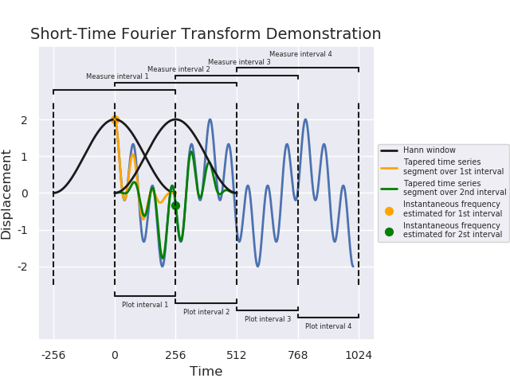

### Morlet Wavelet Transform

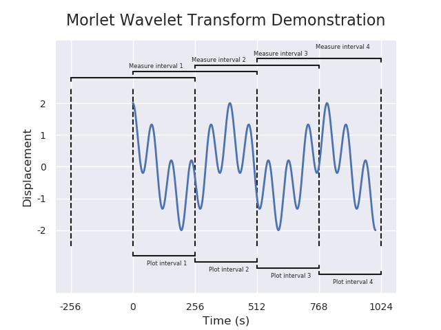

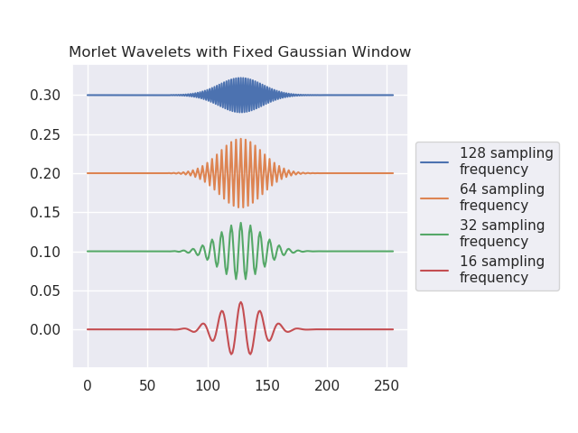

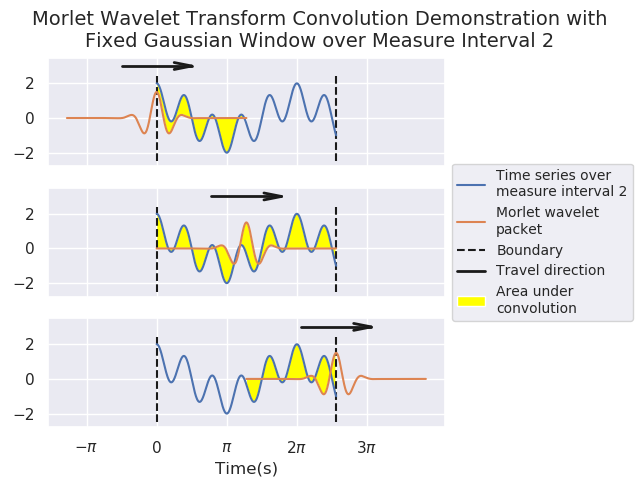

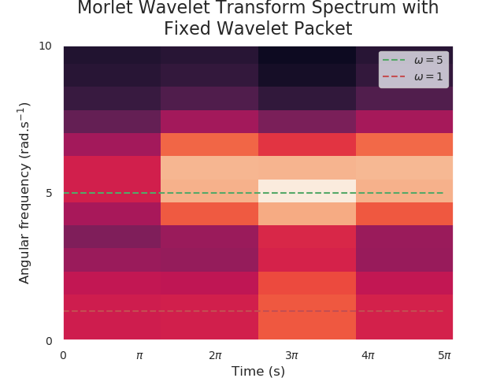

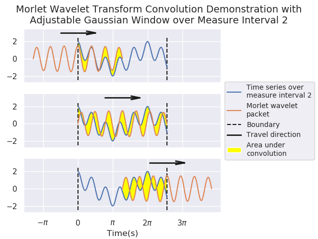

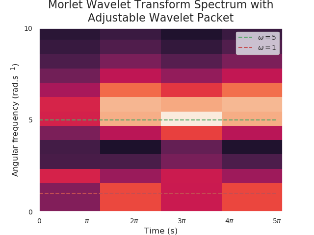
