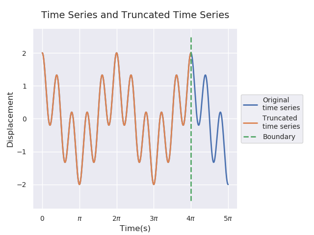
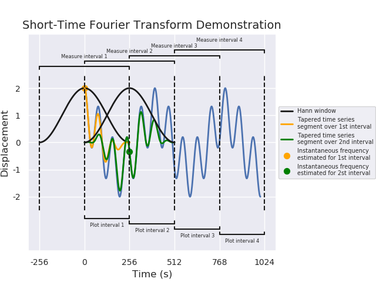

# Instantaneous Frequency
Demonstrating different interpretations and calculations of instantaneous frequency. The figures include in this package attempt to assist in the understanding of the underlying processes. This educational tool come out of work done by Cole van Jaarsveldt, Prof. Gareth W. Peters, Prof. Mike Chantler, and Dr Matthew Ames. Some of the figures included are shown below.

## Time Series

All of the analysis techniques demonstrated below used the following time series. The example time series consists of two pure harmonics also known as sinusoids which is generic term for any Sine or Cosine function. The high frequency component and the low frequency component have frequencies of 5 rad/s and 1 rad/s respectively.  

## Frequency (f) versus Angular Frequency ($\omega$)

Frequency is measured in Hertz (Hz) which has units of $s^{-1}$ which is per second. Angular frequency is measured in radians per second or $rad/s$ or $rad.s^{-1}$. The Diagram above demonstrates how these may be understood and used interchangeably.

## Fourier Transform

## Ghost Frequencies

## Fourier Transform with Tapering

### Short-Time Fourier Transform

### Morlet Wavelet Transform

